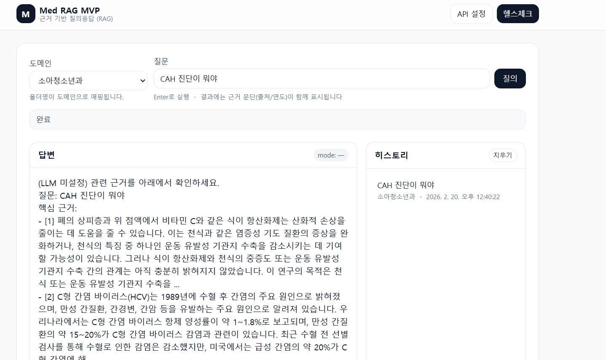

# Med-RAG MVP (의학 도메인 원천/라벨링 JSON → RAG + 자동평가)

## AI 학습 데이타는 AI Hub 공공기관 사이트에서 다운로드 가능합니다.



이 레포는 **의학 도메인 JSON 수백 개(원천데이터 + 라벨링/QA 데이터)**를 이용해,
- (1) 공통 스키마로 **정규화(JSONL)** 하고
- (2) **Qdrant 벡터DB**에 문서 청킹/임베딩/적재 후
- (3) **근거 포함 RAG 질의 API(FastAPI)** 를 제공하며
- (4) 라벨링 QA로 **자동 평가(Eval)** 를 돌릴 수 있는 MVP입니다.

> ✅ “폴더 = 도메인(과)” 구조를 그대로 활용하도록 설계했습니다.

---

## 0) 전제
- Python 3.11+
- Docker(선택: Qdrant 실행)
- (선택) Ollama 또는 OpenAI API Key

---

## 1) 폴더 구조(권장)
아래처럼 두 루트를 둡니다. 하위 폴더는 과/도메인명으로 자유롭게 구성합니다.

```
DATA_ROOT/
  01.원천데이터/
    소아청소년과/
      cid_....json
    응급의학과/
      cid_....json
  02.라벨링데이터/
    소아청소년과/
      필수_....json
    내과/
      필수_....json
```

---

## 2) 빠른 시작(로컬)
### 2-1. 가상환경 + 의존성
```bash
python3 -m venv .venv
# windows: .venv\Scripts\activate
source .venv/bin/activate
pip install -U pip
pip install -r requirements.txt
```

### 2-2. Qdrant 실행(도커)
```bash
docker compose up -d qdrant
```

### 2-3. 정규화(JSONL 생성)
```bash
python3 scripts/normalize.py --data-root DATA_ROOT --out-dir data
# 결과:
#   data/documents.jsonl
#   data/qas.jsonl
```

### 2-4. 임베딩 + 인덱싱(Qdrant 적재)
```bash
python3 scripts/index_qdrant.py --docs data/documents.jsonl
```

### 2-5. API 실행
```bash
uvicorn api.main:app --reload --port 8000
```

테스트:
```bash
curl -X POST http://localhost:8000/ask \
  -H "Content-Type: application/json" \
  -d '{"query":"CAH 조기진단에 가장 중요한 호르몬 수치는?", "domain":"소아청소년과"}'
```

---

## 3) LLM 설정(선택)
기본은 **LLM 없이** “근거 문단 + 간단 요약”을 반환합니다.
더 자연스러운 답변을 원하면 `.env`를 만들고 아래 중 하나를 사용하세요.

### 3-1. Ollama(추천: 로컬)
```env
LLM_PROVIDER=ollama
OLLAMA_BASE_URL=http://localhost:11434
OLLAMA_MODEL=llama3.1
```

### 3-2. OpenAI
```env
LLM_PROVIDER=openai
OPENAI_API_KEY=...
OPENAI_MODEL=gpt-4o-mini
```

---

## 4) 자동 평가(Eval)
라벨링 QA(JSONL)를 이용해 기본 성능을 점검합니다.

```bash
python3 eval/run_eval.py --qas data/qas.jsonl --out eval_report.json
```

---


