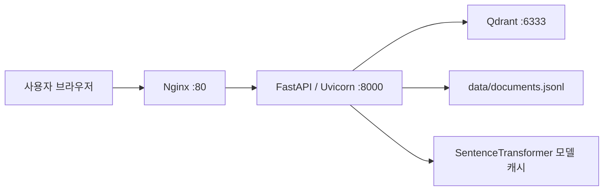
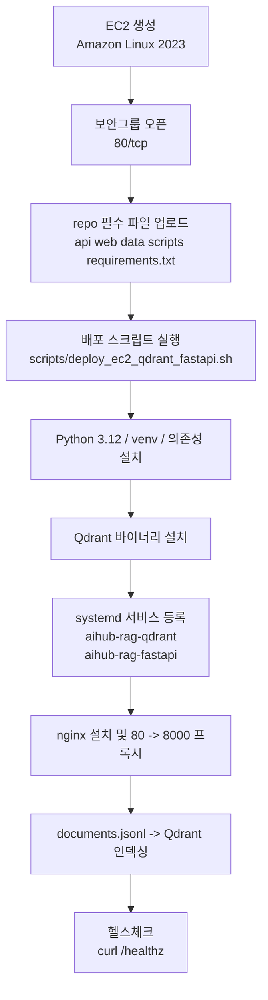

<link rel="stylesheet" href="https://cdnjs.cloudflare.com/ajax/libs/font-awesome/6.5.2/css/all.min.css" />

## AI 학습 데이터는 AI Hub 공공기관 사이트에서 다운로드 가능합니다.


이 레포는 **심리상담·의료·법률·여행 도메인 문서 데이터**를 이용해,
- (1) 공통 스키마로 **정규화(JSONL)** 하고
- (2) 문서를 직접 읽는 **경량 텍스트 검색 API(FastAPI)** 를 제공하며
- (3) PC/태블릿/모바일 **반응형 3단 웹 UI** 로 질의·근거 조회를 지원하며
- (4) 라벨링 QA로 **자동 평가(Eval)** 를 돌릴 수 있는 MVP입니다.

> <i class="fa-solid fa-circle-check"></i> "폴더 = 도메인" 구조를 그대로 활용하도록 설계했습니다.

지원 도메인: `02.법률` | `01.의료` | `우울증` | `불안장애` | `중독` | `일반군` | `여행`

---

## JSONL을 사용하는 이유

**1. 벡터 데이터베이스(Vector DB)와의 높은 호환성**
RAG의 핵심 저장소인 벡터 DB(예: Pinecone, Milvus, Chroma, FAISS 등)에 데이터를 삽입(Upsert)할 때, 대다수의 DB API가 JSON 객체나 딕셔너리 형태의 입력을 요구합니다.
- JSONL의 각 행을 읽어서 곧바로 벡터 DB의 Document 객체나 Payload로 변환할 수 있기 때문에 데이터 파이프라인 구축이 매우 간결해집니다.

**2. 데이터 수정 및 추가(Append)의 용이성**
RAG 시스템은 새로운 문서가 추가되거나 기존 문서가 업데이트되는 일이 빈번합니다.
- 일반 JSON 파일은 데이터를 추가하려면 파일 전체를 열어 배열 끝에 콤마(,)를 붙이고 새 데이터를 넣어야 해서 비효율적입니다.
- **JSONL은 파일의 맨 끝(EOF)에 새로운 줄을 단순히 추가(Append)**하기만 하면 되므로, 실시간 데이터 파이프라인이나 로그 수집기에서 쓰기에 매우 유리합니다.

**3. 데이터 오염 및 예외 처리 방지**
텍스트 데이터에는 줄바꿈(\n), 큰따옴표("), 이모지, 특수문자 등이 포함되어 있어 단순 텍스트 플랫 파일로 관리하면 파싱할 때 구조가 깨지기 쉽습니다. JSONL 구조 내에서 텍스트는 자동으로 이스케이프(Escape) 처리되어 저장되므로 데이터가 오염되거나 잘리는 현상을 방지할 수 있습니다.

**요약**: 일반 텍스트를 JSONL로 만드는 이유는 **"대용량 데이터를 메모리 낭비 없이 한 줄씩 읽으면서, 텍스트 본문과 메타데이터(출처 등)를 안전하게 묶어 벡터 DB에 쉽게 집어넣기 위함"**입니다.

---

## 0) 전제
- Python 3.11+
- Docker
- (선택) OpenAI API Key

---

## 1) 폴더 구조(권장)
아래처럼 두 루트를 둡니다. 하위 폴더는 과/도메인명으로 자유롭게 구성합니다.

```
DATA_ROOT/
  01.원천데이터/
    소아청소년과/
      cid_....json
    응급의학과/
      cid_....json
  02.라벨링데이터/
    소아청소년과/
      필수_....json
    내과/
      필수_....json
```

---

## 2) 빠른 시작(로컬)
### 2-1. 가상환경 + 의존성
```bash
python3 -m venv .venv
# windows: .venv\Scripts\activate
source .venv/bin/activate
pip install -U pip
pip install -r requirements.txt
```

### 2-2. 정규화(JSONL 생성)
```bash
python3 scripts/normalize.py --data-root DATA_ROOT --out-dir data
# 결과:
#   data/documents.jsonl
#   data/qas.jsonl
```

### 2-3. 문서 검증
```bash
python3 scripts/index_qdrant.py --docs data/documents.jsonl
```

### 2-4. API 실행
```bash
uvicorn api.main:app --reload --port 8000
```

테스트:
```bash
curl -X POST http://localhost:8000/ask \
  -H "Content-Type: application/json" \
  -d '{"query":"엑스레이 장치의 디레이팅 모드는 어떤 상황에서 활성화되나요?","domain":"01.의료"}'
```

---

## 3) LLM 설정(선택)
기본은 **LLM 없이** "근거 문단 + 간단 요약"을 반환합니다.
더 자연스러운 답변을 원하면 `.env`를 만들고 아래 중 하나를 사용하세요.

### 3-1. OpenAI
```env
LLM_PROVIDER=openai
OPENAI_API_KEY=...
OPENAI_MODEL=gpt-4o-mini
```

기본은 `LLM_PROVIDER=none` 이며, 이 경우 근거 중심 요약만 반환합니다.

---

## 4) 심리상담 데이터 수집 (DATA_ROOT)

DATA_ROOT에 AI Hub 심리상담 데이터셋을 배치한 뒤 아래 스크립트로 JSONL에 추가합니다.

```
DATA_ROOT/
  01.원천데이터/
    001. 우울증/0001. 1회기/resource_*.txt   ← 상담 대화 전사록
    002. 불안장애/...
    003. 중독/...
    004. 일반군/...
  02.라벨링데이터/
    001. 우울증/0001. 1회기/label_*.json     ← 케이스 요약 + 증상 레이블
    ...
```

```bash
python3 scripts/ingest_counseling.py --data-root DATA_ROOT --out data/documents.jsonl
```

- 동일 환자 ID의 TXT(대화록) + JSON(요약)을 병합해 하나의 문서로 인덱싱합니다.
- 기존 `documents.jsonl`에 **append** 모드로 추가하므로 의료·법률 데이터는 유지됩니다.
- `--overwrite` 플래그로 중복 방지 없이 강제 재추가할 수 있습니다.

---

## 5) 여행 데이터 수집 및 Qdrant 인제스트

### 데이터 위치 (AI Hub: 한국관광 데이터)

```
travel/
  3.개방데이터/
    1.데이터/
      Training/
        01.원천데이터/    TS_photo.zip          ← 훈련 관광사진
        02.라벨링데이터/  TL_csv.zip            ← 방문지·여행 코스 CSV
                          TL_gps_data.zip       ← 여행자 GPS 이동 데이터
      Validation/
        01.원천데이터/    VS_photo.zip          ← 검증 관광사진
        02.라벨링데이터/  VL_csv.zip            ← 검증 방문지·여행 코스 CSV
                          VL_gps_data.zip       ← 검증 GPS 데이터
      Sublabel/           SbL.zip               ← 관광사진 JSON 캡션
      Other/              Other.zip             ← 전국 POI 마스터
```

### 5-1. 기본 인제스트 (방문지 통계)

`TL_csv.zip` + `VL_csv.zip`의 방문지 정보를 장소 단위로 집계해 Qdrant에 업로드합니다.

```bash
python scripts/ingest_travel_qdrant.py [--qdrant http://localhost:6333]
```

- 방문 횟수·만족도·재방문 의향·추천 의향·평균 체류시간을 장소별로 집계
- 집·사무실·회사·학교·병원 등 비관광지 자동 제외
- Training + Validation 데이터 합산 처리

### 5-2. 확장 인제스트 (캡션·코스·POI)

3가지 추가 데이터 소스를 Qdrant에 보강합니다.

```bash
python scripts/ingest_travel_enrich_qdrant.py [--qdrant http://localhost:6333] [--poi-limit 50000]
```

| Phase | 소스 파일 | 내용 |
|-------|-----------|------|
| Phase 1 | `SbL.zip` | 관광사진 JSON 캡션 → 장소별 자연어 설명 |
| Phase 2 | `TL/VL_csv.zip` + GPS | TRAVEL_ID 단위 방문 순서를 여행 코스 문서로 변환 |
| Phase 3 | `Other.zip` | 전국 POI 마스터 (최대 `--poi-limit`건, 기본 50,000) |

### Qdrant 컬렉션 스펙

| 항목 | 값 |
|------|----|
| 컬렉션명 | `domain_docs` |
| 임베딩 모델 | `paraphrase-multilingual-MiniLM-L12-v2` |
| 벡터 차원 | 384 |
| 거리 함수 | Cosine |
| 주요 payload 필드 | `domain_name`, `place_name`, `address`, `x_coord`, `y_coord`, `vis_type`, `visit_count`, `source_spec` |

### API 호출 예시 (여행 도메인)

```bash
curl -X POST http://localhost:8000/ask \
  -H "Content-Type: application/json" \
  -d '{"query":"서울 근교 가족 여행지 추천해줘","domain":"여행"}'
```

- `domain_name=여행` 필터로 Qdrant 벡터 검색 수행
- LLM 설정 시: 관광지명·주소·만족도·체류시간 등을 활용한 자연어 추천 생성
- LLM 미설정 시: 관련 관광지 목록(장소명·주소·요약)을 직접 반환

---

## 6) AWS EC2 배포

현재 단일 서버 배포는 `Amazon Linux 2023 + t3.medium` 기준으로 검증했습니다.
구성은 `Nginx(80) -> FastAPI(8000) -> Qdrant(127.0.0.1:6333)` 이며,
앱 데이터는 `data/documents.jsonl`, 벡터 인덱스는 Qdrant 로컬 스토리지를 사용합니다.

### 6-1. 배포 아키텍처


```mermaid
flowchart LR
    U[사용자 브라우저]
    N[Nginx :80]
    F[FastAPI / Uvicorn :8000]
    Q[Qdrant :6333]
    D[data/documents.jsonl]
    M[SentenceTransformer 모델 캐시]

    U --> N
    N --> F
    F --> Q
    F --> D
    F --> M
```

### 6-2. 서버 배포 절차


```mermaid
flowchart TD
    A[EC2 생성<br/>Amazon Linux 2023] --> B[보안그룹 오픈<br/>80/tcp]
    B --> C[repo 필수 파일 업로드<br/>api web data scripts requirements.txt]
    C --> D[배포 스크립트 실행<br/>scripts/deploy_ec2_qdrant_fastapi.sh]
    D --> E[Python 3.12 / venv / 의존성 설치]
    E --> F[Qdrant 바이너리 설치]
    F --> G[systemd 서비스 등록<br/>aihub-rag-qdrant<br/>aihub-rag-fastapi]
    G --> H[nginx 설치 및 80 -> 8000 프록시]
    H --> I[documents.jsonl -> Qdrant 인덱싱]
    I --> J[헬스체크<br/>curl /healthz]
```

### 6-3. 실행 예시

```bash
sudo APP_USER=ec2-user REPO_DIR=/home/ec2-user/aihub-rag \
  WARM_MODEL=0 RUN_TRAVEL_INGEST=0 \
  bash scripts/deploy_ec2_qdrant_fastapi.sh

/opt/aihub-rag/venv/bin/python scripts/ingest_qdrant.py \
  --qdrant http://127.0.0.1:6333 \
  --data /home/ec2-user/aihub-rag/data/documents.jsonl
```

### 6-4. 운영 확인

```bash
systemctl status aihub-rag-qdrant.service
systemctl status aihub-rag-fastapi.service
systemctl status nginx

curl http://127.0.0.1:8000/healthz
curl http://127.0.0.1:6333/collections
curl http://<EC2-PUBLIC-IP>/
```

---

## 7) 자동 평가(Eval)
라벨링 QA(JSONL)를 이용해 기본 성능을 점검합니다.

```bash
python3 eval/run_eval.py --qas data/qas.jsonl --out eval_report.json
```

---

## 8) 디렉터리 구조

| 경로 | 역할 |
|------|------|
| `api/` | FastAPI 애플리케이션 본체. `main.py`에서 `/ask`, `/healthz` 등 엔드포인트 제공 |
| `api/db/` | SQLAlchemy(SQL) + Motor(MongoDB) DB 연결 모듈 |
| `web/` | Tailwind CSS 기반 반응형 SPA. PC 3단/태블릿 2단/모바일 1단 레이아웃 |
| `scripts/` | 데이터 전처리 스크립트 모음 |
| `scripts/normalize.py` | 범용 DATA_ROOT → `documents.jsonl` / `qas.jsonl` 변환기 |
| `scripts/ingest_counseling.py` | 심리상담(우울증·불안장애·중독·일반군) 전용 JSONL 변환기 |
| `scripts/index_qdrant.py` | 문서 유효성 검증 유틸 (Qdrant 없이 경량 검색 모드 안내) |
| `scripts/ingest_travel_qdrant.py` | 여행 방문지 CSV(TL/VL) → 장소 단위 집계 후 Qdrant 업서트 |
| `scripts/ingest_travel_enrich_qdrant.py` | 관광사진 캡션(SbL) + 여행 코스 + POI 마스터 → Qdrant 보강 인제스트 |
| `travel/` | AI Hub 한국관광 데이터 원본 (훈련/검증 CSV·GPS·사진·POI, git 추적 제외) |
| `alembic/` | SQLAlchemy 데이터베이스 마이그레이션 관리. `alembic upgrade head` 로 스키마 적용 |
| `alembic/versions/` | 버전별 마이그레이션 파일 (자동 생성) |
| `eval/` | RAG 정답 품질 자동 평가 모듈 |
| `eval/run_eval.py` | `qas.jsonl`의 Q → `/ask` 호출 → 정답 유사도 측정 후 JSON 리포트 출력 |
| `data/` | 정규화된 JSONL 파일 저장소. `documents.jsonl`, `qas.jsonl` |
| `DATA_ROOT/` | AI Hub 원천·라벨링 데이터 원본 (git 추적 제외) |

---

### AMI 로 저장 후 타인과 공유 ( Public 또는 Private 한 경우 AWS Account ID 로 공유)


```bash
aws ec2 run-instances \
    --image-id ami-044b597f9d5cc927b \
    --instance-type t3.micro \
    --key-name "본인의-키페어-이름" \
    --security-group-ids "sg-보안그룹ID" \
    --subnet-id "subnet-서브넷ID" \
    --region "AMI가-존재하는-리전코드"
```